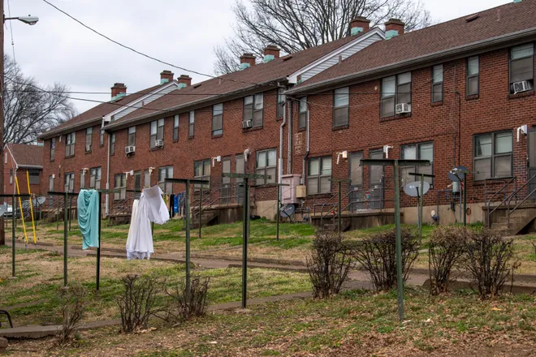

# **King County House Project**

**OVERVIEW**

King County is in the state of Washington in the United States. It is Washington's most populous county and the 13th most populous in the United States. Seattle, the state's most populated city, serves as the county seat.

**BUSINESS PROBLEM**

A Seattle real estate agent wants to discover which elements have a substantial impact on the price of a house in King County. This will help in strategizing on the best criterion to use to maximise profit. The company has tasked me with developing a model that will be used to estimate property prices in King County and obtaining substantial advice on activities that they should take to ensure the business's success.

**BUSINESS OBJECTIVES**

* To understand factors that are most predictive of price.
* Which house features will give the best deals.
* Obtain a model that will be of use when predicting the price of a property.

**DATA STRUCTURE AND DATA UNDERSTANDING:**

The dataset contains over 20,000 records of homes sold with 20 features. The data contains a numeric, discrete and categorical data.

**COLUMN DESCRIPTION**

* id - Unique identifier for a house
* date - Date house was sold
* price - Sale price (prediction target)
* bedrooms - Number of bedrooms
* bathrooms - Number of bathrooms
* sqft_living - Square footage of living space in the home
* sqft_lot - Square footage of the lot
* floors - Number of floors (levels) in house
* sqft_above - Square footage of house apart from basement
* sqft_basement - Square footage of the basement
* yr_built - Year when house was built
* yr_renovated - Year when house was renovated
* zipcode - ZIP Code used by the United States Postal Service
* lat - Latitude coordinate
* long - Longitude coordinate
* sqft_living15 - The square footage of interior housing living space for the nearest 15 neighbors
* sqft_lot15 - The square footage of the land lots of the nearest 15 neighborsaterfront - Whether the house is on a waterfront
* view - Quality of view from house
* condition - How good the overall condition of the house is. Related to maintenance of house.
* grade - Overall grade of the house. Related to the construction and design of the house.

**DATA  PREPARATION:**

we drop columns that won't be used for this analysis, cleaned the data by removing outliers.

Our target variable is for this task is price.

Checking the correlation of the features with price, we see that: sqft_living, sqft_above, sqft_living15 and bathrooms have a high correlation with price.
